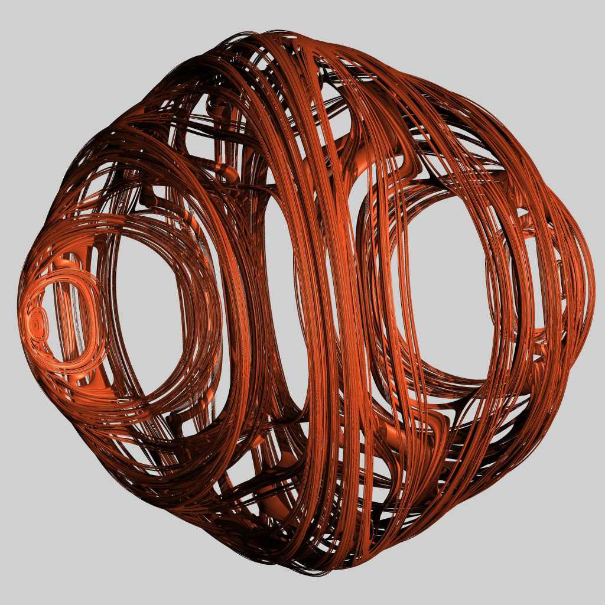

# Senior Synthesis Project 2022–2023



## About <a name="about"></a>

This repository contains the final results of my Undergraduate Mathematics Senior Synthesis. The results were given in a presentation on May 18th 2023 and the paper was submitted June 9th 2023. Below are links to PDFs for both the presentation and paper.


## Building <a name="building"></a>

Both the presentation and paper are written in [Emacs Org Mode](https://orgmode.org/), which is compiled to latex, which is compiled to PDFs. Graphs in the presentation are generated inside the org file using python. Thus, to build one must have working org-mode, latex, and python environments. Alternatively, the pre-compiled tex files and images can be used which only requires latex.

### 1. Python and org-mode

In a python environment of your choice, install the required python dependencies:

``` python
pip install matplotlib numpy sympy numpy-quaternion
```

Ensure your Org Mode latex export uses xelatex. This can be accomplished by setting org-latex-pdf-process to the preferred latex exporter variation. For example:

``` emacs-lisp
(setq org-latex-pdf-process '("PDFLATEX=\"xelatex\" texi2dvi --shell-escape --pdf %f"))
```

### 2. LaTeX

Both the Presentation and Paper use a large variety of tex packages. I recommend you install the `texlive-full` package from your distribution of choice.

For Arch Linux:

``` shell
sudo pacman -S textlive # Group of all texlive packages
```
